# 校园圈子 - Campus Circle

> 面向高校学生的实名社交平台，支持学生证实名审核、校园动态发布、点赞评论、站内私信、举报审核、密码找回，并对外开放 AI 数据接口。

---

## 页面预览

<table>
  <tr>
    <td width="50%" align="center"><b>学生登录 · 亮色</b><br>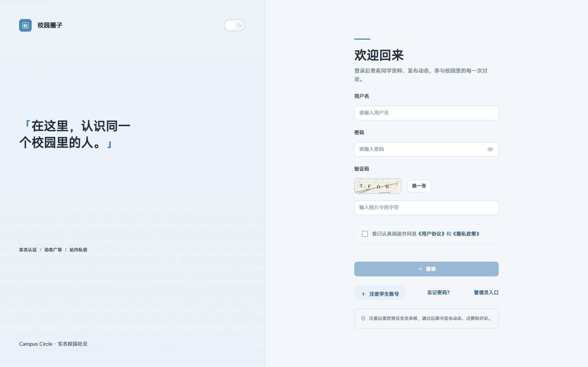</td>
    <td width="50%" align="center"><b>学生登录 · 暗色</b><br>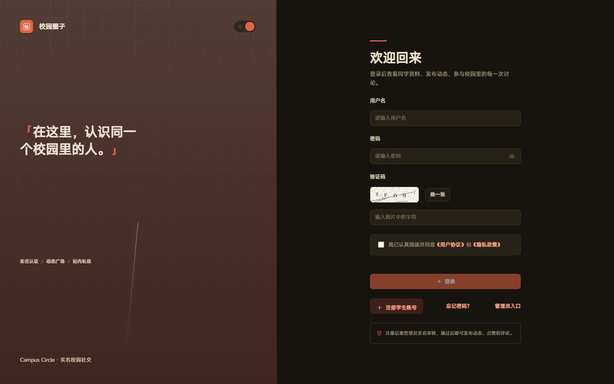</td>
  </tr>
  <tr>
    <td align="center"><b>学生中心 · 亮色</b><br>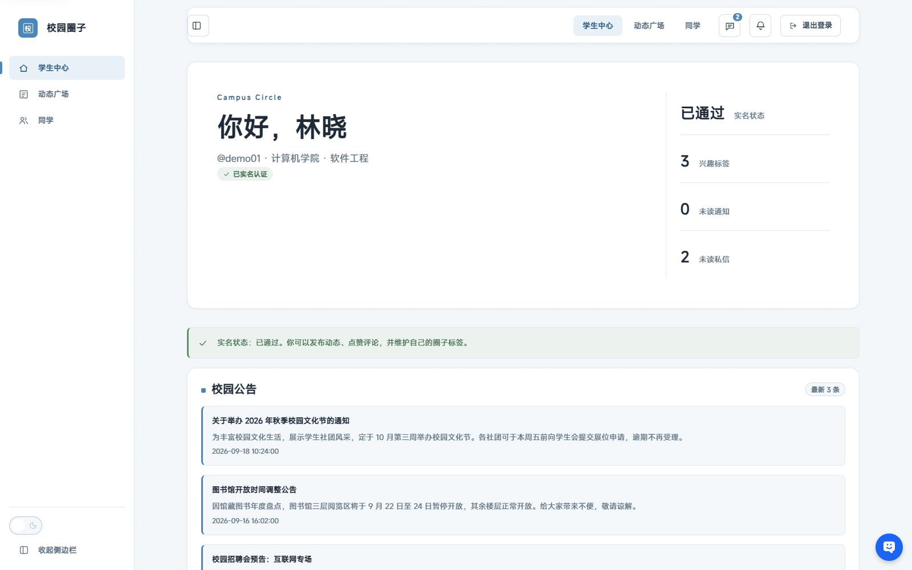</td>
    <td align="center"><b>学生中心 · 暗色</b><br>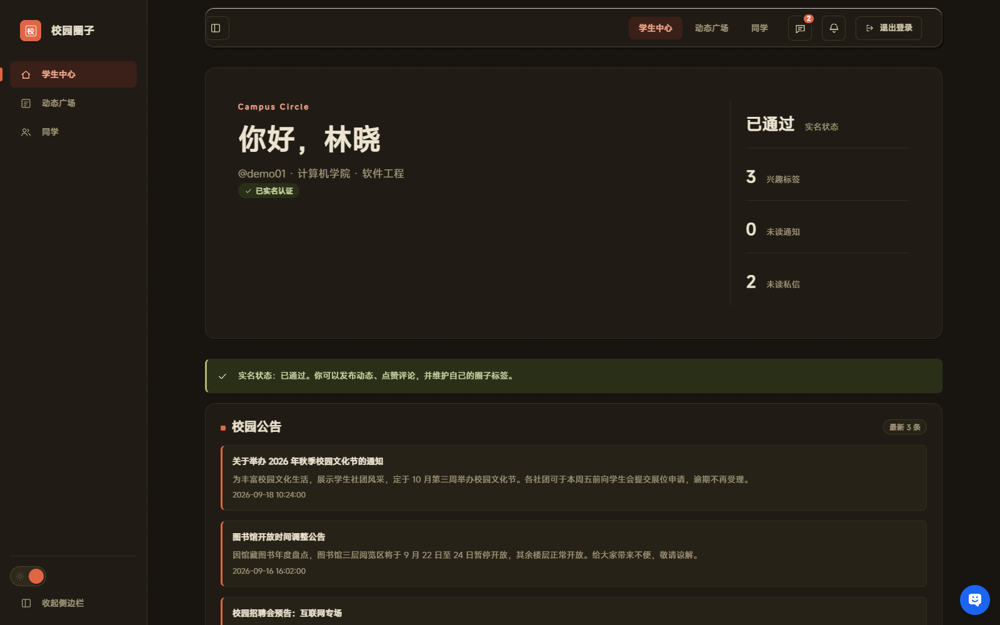</td>
  </tr>
  <tr>
    <td align="center"><b>动态广场</b><br>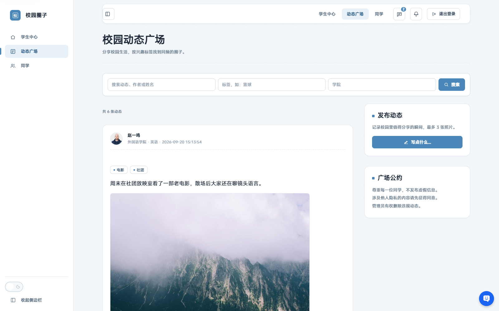</td>
    <td align="center"><b>已认证同学</b><br>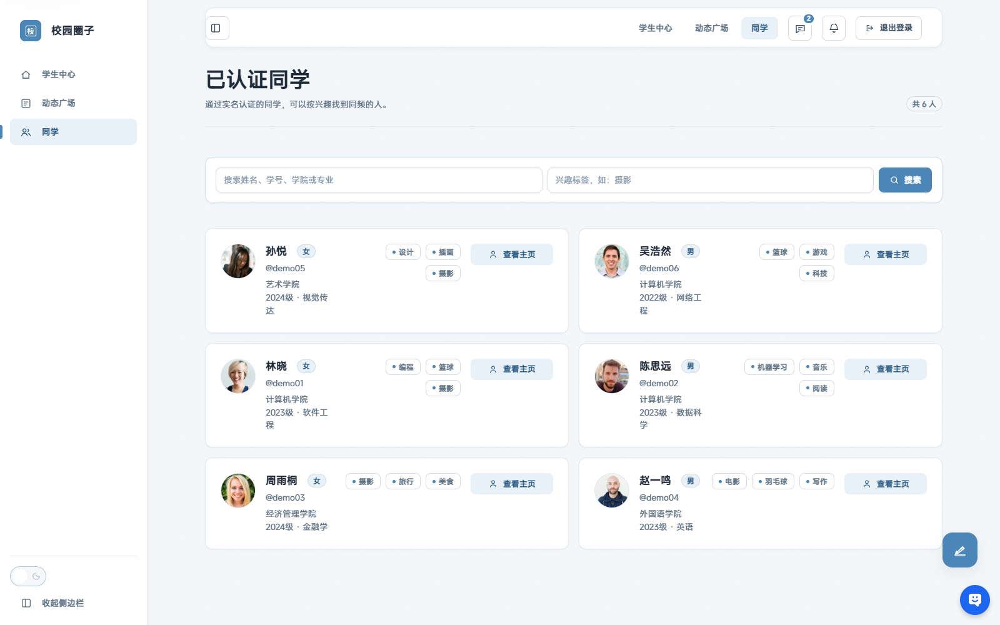</td>
  </tr>
  <tr>
    <td align="center"><b>私信列表</b><br>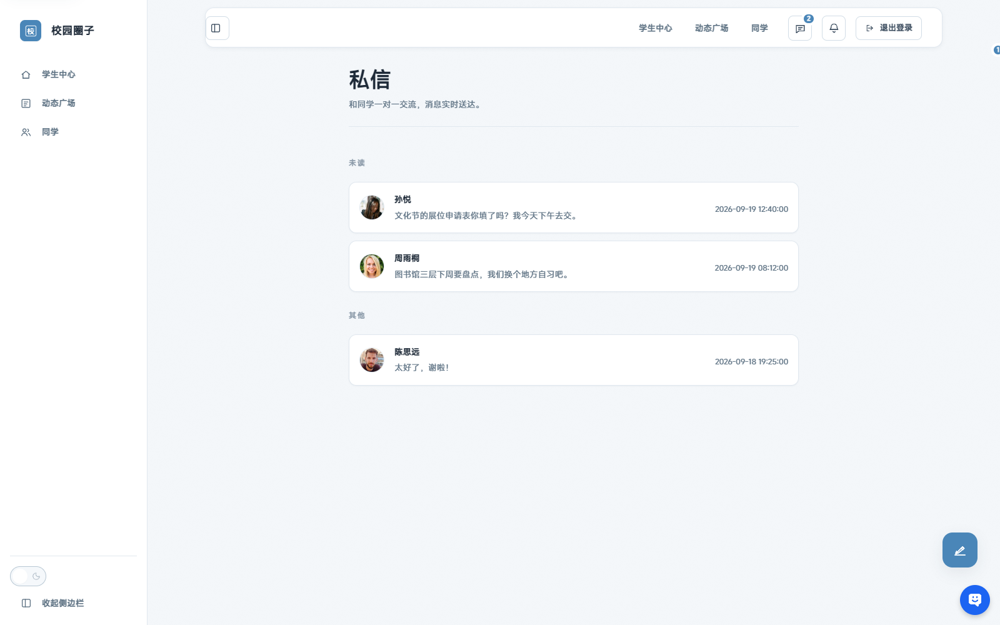</td>
    <td align="center"><b>聊天会话</b><br>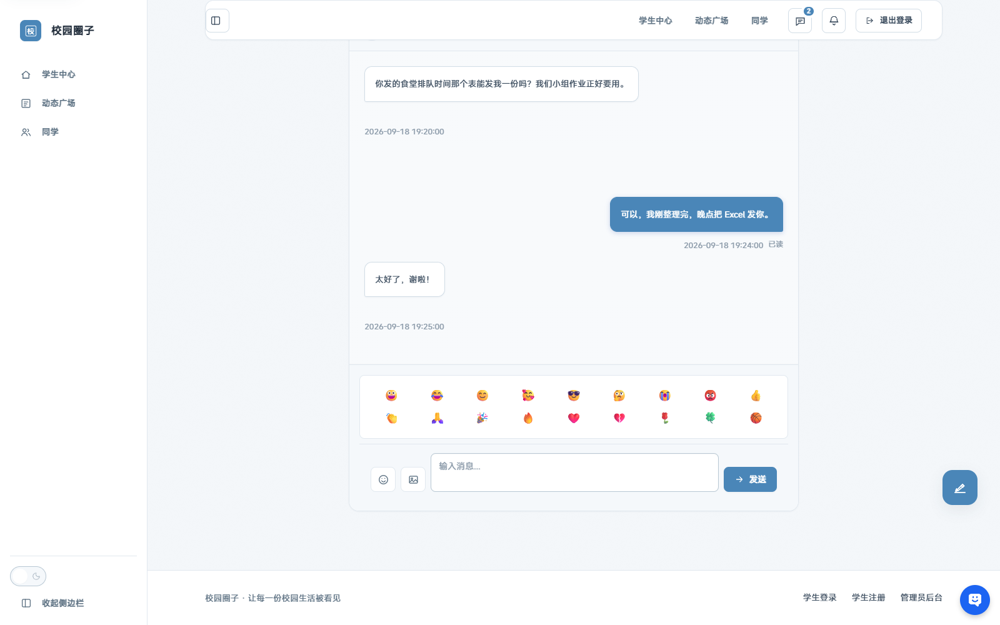</td>
  </tr>
  <tr>
    <td align="center"><b>通知中心</b><br>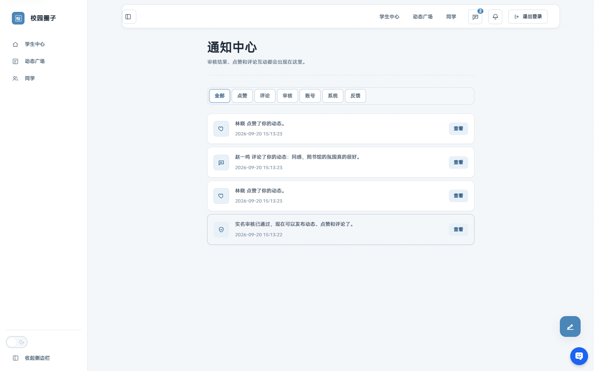</td>
    <td align="center"><b>学生注册</b><br>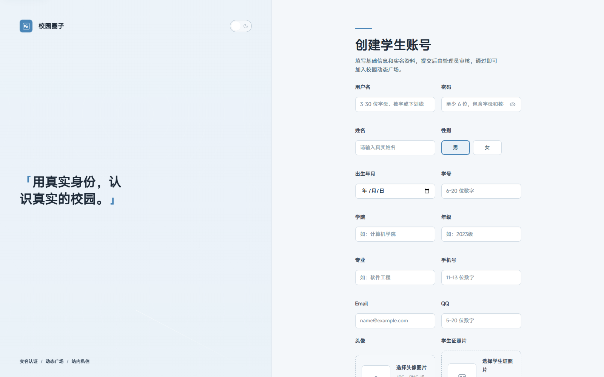</td>
  </tr>
  <tr>
    <td align="center"><b>管理员登录</b><br>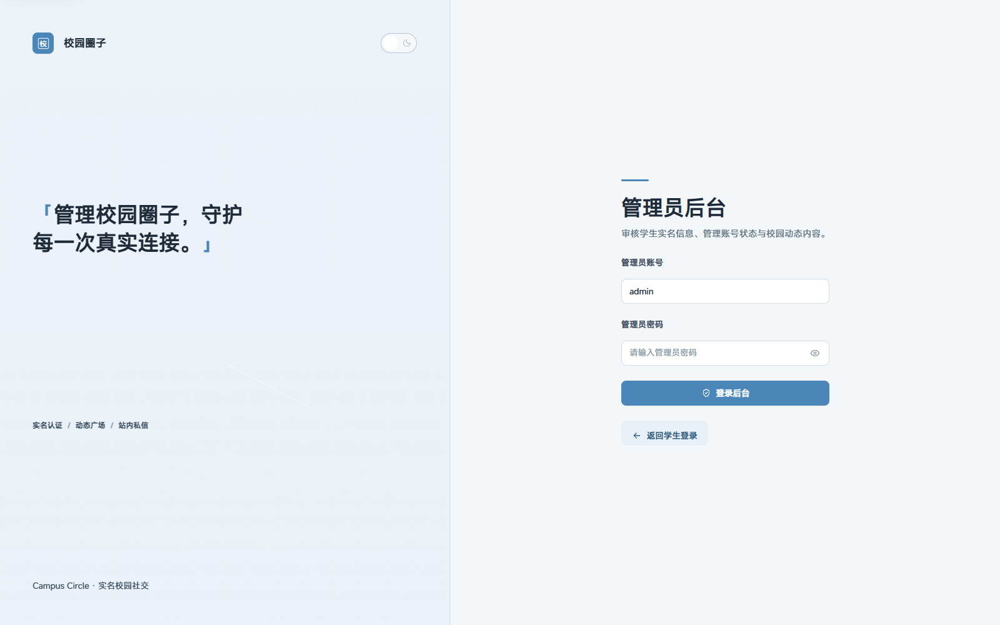</td>
    <td align="center">支持亮色 / 暗色双主题，<br>移动端视口无横向溢出<br><br>演示账号：<code>demo01</code> / <code>Demo@123456</code></td>
  </tr>
</table>

---

## 项目亮点

- 实名认证工作流：上传学生证，管理员核对证件后审核，关键资料变更自动重新审核
- 动态广场支持关键词、标签、学院搜索，无限滚动加载，点赞评论通过 JSON API 无刷新交互
- 评论支持评论作者、动态发布者、管理员三方删除，支持 @提及 高亮
- 站内通知支持分类筛选与分页
- 举报审核队列：学生举报动态/评论，管理员删除目标或忽略举报
- 同学主页与同频推荐：按学院、年级、共同标签推荐可能认识的人
- 找回密码支持手机短信或邮箱验证码，验证码限时、限次、限频
- 关注系统：关注/取关、关注者统计、关注通知
- 通知偏好：可按类型关闭点赞、评论、审核、关注等通知
- 敏感词过滤：动态和评论发布前自动拦截违规内容
- 登录、注册、找回密码增加验证码
- 单设备登录：新会话登录后自动踢出旧会话
- 管理端近 7 天活跃看板、审计日志分页、学生 CSV 导出
- 站内私信：会话列表、未读角标、SSE 实时通知（失败自动回退轮询）、2 分钟内撤回、表情面板、图片消息、本地草稿、已读状态、加载更早消息
- 动态多图：发布最多 3 张图片，广场和主页展示图集
- 动态收藏：一键收藏/取消收藏，我的收藏页集中回看
- 话题标签：#话题 自动识别，点击即可按话题筛选动态
- 动态草稿：发布页自动保存，刷新后恢复，发布成功后自动清除
- 评论回复：支持回复某条评论，带“回复 @xxx”展示和回复通知
- 管理员权限分级：超级管理员/运营管理员，敏感后台入口按角色隐藏
- 管理员账号管理：超级管理员可创建运营管理员、调整角色、停用/启用账号
- 管理员操作回滚：动态、评论、私信删除可在审计日志一键恢复
- 拉黑用户：被拉黑后无法关注、私信、点赞、评论互动
- 会话置顶与免打扰：聊天可置顶会话、关闭新消息提醒
- 隐私设置：可限制仅自己关注的人发送私信，可关闭个人主页公开
- 业务频控：动态、评论、私信均有限流，保留用户名不可注册
- 校园公告：管理员发布公告，学生中心首页展示最新公告
- 私信审计：管理端可检索、删除私信并记录审计日志
- 管理端 CSV 导出：公告、举报、私信、动态、审计、日报均可导出
- 运营数据日报：按天统计注册、认证、内容、互动、举报与活跃学生
- AI 只读接口：`ai_api.php` 通过密钥鉴权，向 AI 助手开放学生、动态、公告的公开数据查询
- 管理员 AI 接口：`ai_admin_api.php` 使用独立密钥，支持全量数据查询与核心管理操作
- 亮色 / 暗色双主题：Design Token 驱动，首屏内联脚本写入主题避免闪烁
- 生产部署：Nginx/Apache 配置、生产 Docker Compose、健康检查、备份脚本
- 自动化安全回归测试
- Playwright E2E：登录、注册、发布动态、私信、管理员改密、移动端无溢出端到端测试
- 意见反馈闭环：学生提交反馈（支持图片附件），管理员按状态处理并通知学生
- 30 天运营趋势：注册、动态、评论、私信、活跃学生走势与 CSV 导出
- 移动端适配：手机视口无横向溢出，聊天、管理表格、趋势图均可横向滑动
- 私信列表按未读分组
- 管理员二次验证（TOTP）、SSE 实时通知、多尺寸缩略图、健康检查接口
- 登录/注册/找回密码限流、CSRF、bcrypt、图片真实性校验与重编码、安全响应头
- Docker Compose 一键启动，版本化 SQL 迁移（001-018），种子数据，GitHub Actions CI

---

## 技术栈

| 类别 | 技术 |
|------|------|
| 后端 | PHP 7.3+ / 8.x, MySQLi 预处理语句 |
| 数据库 | MySQL 5.7+ / 8.0 |
| 前端 | HTML + CSS + 原生 JavaScript (Fetch API) |
| 测试 | PHPUnit 9 + 自研单元/集成测试 + Playwright E2E |
| 工程化 | Composer, Docker Compose, GitHub Actions, PHPStan, PHP CS Fixer |

## 架构

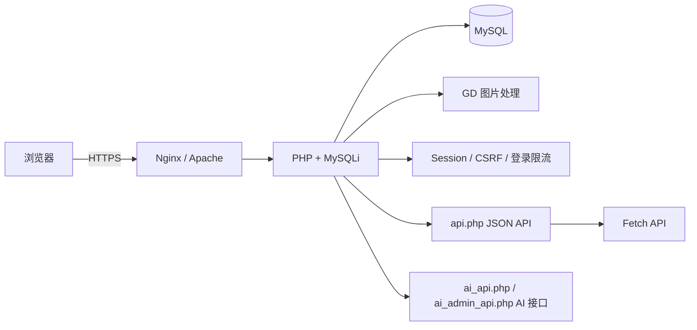

---

## 快速开始

### 方式一：PHPStudy / 本地环境

1. 复制 `.env.example` 为 `.env` 并配置数据库
2. 执行 `php bin/migrate.php` 创建表结构
3. 可选执行 `php bin/seed.php` 生成演示数据
4. 将项目放入 Web 根目录，访问 `p_loginStu.php`

内置服务器调试（注意末尾的 `index.php`，它是路由入口）：

```bash
php -S 127.0.0.1:8099 -t . index.php
```

管理员初始账号：`admin` / `Admin@123456`，首次登录后强制修改。

### 方式二：Docker Compose

```bash
docker compose up -d --build
```

访问 `http://localhost:8080/p_loginStu.php`。

首次访问会自动执行迁移并创建管理员账号。

### 演示数据

```bash
php bin/seed.php          # 6 个演示学生 + 动态
php bin/seed_media.php    # 头像、动态配图
```

演示学生账号 `demo01` ~ `demo06`，密码统一为 `Demo@123456`。

---

## 项目结构

```text
campus/
├── index.php                   # 唯一入口：URL 路由 + 404
├── api/
│   ├── api.php                 # 站内 JSON API
│   ├── ai_api.php              # AI 只读数据接口
│   └── ai_admin_api.php        # 管理员 AI 接口
├── pages/                      # 页面入口（51 个 p_*.php）
│   ├── p_loginStu.php          # 学生登录
│   ├── p_welcomeStu.php        # 学生中心
│   ├── p_dynamics.php          # 动态广场
│   ├── p_admin*.php            # 管理后台
│   ├── p_export*.php           # CSV 导出
│   └── ...
├── lib/
│   ├── dbInfo.php              # 环境变量与 .env 加载
│   ├── manageDB.php            # 数据库引导与自动迁移
│   ├── layout.php              # 页面布局与 UI 组件
│   ├── bootstrap.php           # 安全 Session 与响应头
│   ├── core.php                # 数据库连接、CSRF、环境配置
│   ├── migrations.php          # SQL 迁移执行器
│   ├── auth.php                # 登录、限流、密码找回、单设备会话
│   ├── student.php             # 学生注册、资料、推荐
│   ├── dynamic.php             # 动态、点赞、评论
│   ├── message.php             # 站内私信
│   ├── follow.php              # 关注关系
│   ├── block.php               # 拉黑
│   ├── notification.php        # 站内通知
│   ├── prefs.php               # 通知偏好
│   ├── announcement.php        # 校园公告
│   ├── feedback.php            # 意见反馈
│   ├── audit.php               # 管理员审计
│   ├── report.php              # 举报审核
│   ├── moderation.php          # 敏感词与内容审核
│   ├── upload.php              # 图片上传与重编码
│   ├── captcha.php             # 验证码
│   ├── analytics.php           # 运营趋势统计
│   ├── stats.php               # 后台统计
│   ├── export.php              # CSV 导出
│   ├── settings.php            # 隐私与会话设置
│   ├── rate_limit.php          # 业务频控
│   ├── logger.php              # 日志
│   ├── helpers.php             # 通用辅助函数
│   └── maintenance.php         # 过期数据清理
├── assets/
│   ├── css/                    # style.css、design-system.css 与分层样式
│   ├── js/                     # app.js 与 campus.js
│   ├── img/                    # favicon.svg
│   └── media/                  # 演示头像与场景图
├── database/
│   ├── schema.sql              # 完整表结构
│   └── migrations/             # 001-018 版本化迁移
├── bin/
│   ├── migrate.php             # 版本化迁移
│   ├── seed.php                # 演示数据
│   ├── seed_media.php          # 演示图片数据
│   ├── cleanup.php             # 清理过期记录
│   ├── health.php              # 健康检查
│   └── e2e_reset.php           # E2E 测试数据重置
├── config/
│   └── sensitive_words.php     # 敏感词配置
├── deploy/                     # 生产环境部署配置
├── scripts/                    # 备份与部署脚本
├── docs/
│   ├── screenshots/            # README 截图
│   ├── architecture.md         # 架构说明
│   ├── api.md                  # API 文档
│   ├── design-system.md        # 设计系统
│   ├── security.md             # 安全设计说明
│   ├── deploy.md               # 部署指南
│   ├── openapi.yaml            # OpenAPI 规范
│   └── roadmap.md              # 项目路线图
├── tests/
│   ├── Unit/                   # PHPUnit 单元测试
│   ├── run.php                 # 轻量单元测试
│   ├── integration.php         # MySQL 集成测试
│   ├── security.php            # 安全回归测试
│   └── e2e/                    # Playwright 端到端测试
├── benchmark/                  # 负载测试脚本
├── Dockerfile
├── docker-compose.yml
└── .github/workflows/ci.yml
```

### URL 路由

页面与接口物理上位于 `pages/` 和 `api/`，但**对外 URL 保持原样**：

```text
/p_loginStu.php   ->  index.php  ->  pages/p_loginStu.php
/api.php          ->  index.php  ->  api/api.php
/ai_api.php       ->  index.php  ->  api/ai_api.php
```

`index.php` 只转发文件名白名单内真实存在的入口，并对文件名做严格校验，因此不存在路径穿越或任意文件包含风险。

> **部署注意**：需要让 Web 服务器把根目录下不存在的 `.php` 请求回退到 `index.php`（Nginx 为 `try_files $uri /index.php?$query_string;`，Apache 已由 `.htaccess` 处理）。完整配置见 [docs/deploy.md](docs/deploy.md#4-目录结构与-url-路由重要)。

---

## 数据库设计

| 表 | 说明 |
|----|------|
| `user` | 用户账号，包含角色、审核状态与单设备会话令牌 |
| `student` | 学生实名资料、学生证照片、兴趣标签 |
| `dynamic` | 校园动态 |
| `dynamic_photo` | 动态多图 |
| `dynamic_favorite` | 动态收藏 |
| `dynamic_draft` | 动态草稿 |
| `comment` | 动态评论（支持回复） |
| `like` | 动态点赞 |
| `message` | 站内私信（支持图片） |
| `conversation_setting` | 会话置顶与免打扰 |
| `follow` | 关注关系 |
| `block` | 拉黑关系 |
| `privacy` | 隐私设置 |
| `notification` | 站内通知 |
| `notification_pref` | 通知偏好 |
| `announcement` | 校园公告 |
| `feedback` | 意见反馈 |
| `sensitive_word` | 敏感词库 |
| `report` | 举报审核队列 |
| `audit_log` | 管理员操作审计 |
| `admin_rollback` | 管理员操作回滚快照 |
| `action_log` | 业务操作频控记录 |
| `login_attempt` | 登录与注册限流 |
| `password_reset` | 密码重置验证码 |
| `schema_migrations` | 已执行迁移版本 |

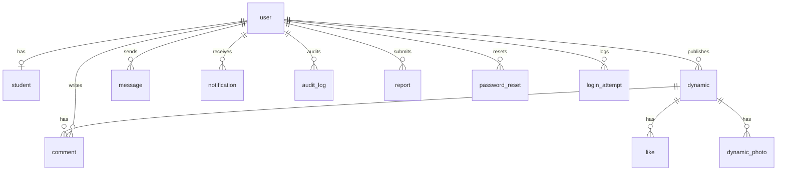

---

## API

### 站内 JSON API

统一入口 `api.php`，返回 JSON，POST 操作需要 CSRF Token。

| 方法 | 地址 | 说明 |
|------|------|------|
| GET | `api.php?action=unread` | 获取未读通知数 |
| GET | `api.php?action=health` | 健康检查（无需登录） |
| POST | `api.php` | `action=like` 点赞/取消点赞 |
| POST | `api.php` | `action=comment` 发表评论 |
| POST | `api.php` | `action=deleteComment` 删除评论 |
| POST | `api.php` | `action=sendMessage` 发送私信（支持图片字段 `image`） |
| GET | `api.php` | `action=messages` 轮询新私信 |
| POST | `api.php` | `action=recallMessage` 撤回私信 |
| GET | `api.php` | `action=messagesBefore` 加载更早私信 |
| POST | `api.php` | `action=conversationSetting` 会话置顶/免打扰 |
| POST | `api.php` | `action=privacy` 更新隐私设置 |
| POST | `api.php` | `action=block` 拉黑/解除拉黑 |
| POST | `api.php` | `action=readNotifications` 全部标记已读 |

### AI 数据接口

供 AI 助手/智能体调用的独立接口，使用 `Authorization: Bearer <key>` 或 `X-API-Key` 头鉴权，密钥通过环境变量配置（`AI_API_KEY` / `AI_ADMIN_API_KEY`），与站点账号体系隔离。

| 入口 | 说明 |
|------|------|
| `ai_api.php?action=students` | 查询已认证学生公开资料（只读） |
| `ai_api.php?action=dynamics` | 查询动态列表（只读） |
| `ai_api.php?action=announcements` | 查询校园公告（只读） |
| `ai_admin_api.php` | 管理员级全量数据查询与核心管理操作 |

---

## 安全机制

- 密码使用 bcrypt 哈希存储
- 所有 SQL 使用 MySQLi 预处理语句
- 所有写操作校验 CSRF Token
- 登录、注册、找回密码均有限流，动态/评论/私信有业务频控
- 单设备登录：新会话使旧会话令牌失效
- Session 启用 strict mode、HttpOnly、SameSite，HTTPS 下启用 Secure
- 输出统一 HTML 转义防 XSS
- 上传图片通过 `getimagesize()` 校验，JPEG/PNG 重新编码去除 EXIF 并限制尺寸
- 响应头包含 CSP、X-Frame-Options、X-Content-Type-Options、Referrer-Policy
- 生产环境强制要求通过环境变量注入数据库密码与初始管理员密码
- AI 接口使用独立密钥 + `hash_equals` 时序安全比对
- 管理员二次验证（TOTP）
- 管理员通过学生账号前必须勾选“已核实学生证”

---

## 测试

```bash
composer install
vendor/bin/phpunit
php tests/run.php
php tests/integration.php
php tests/security.php
vendor/bin/phpstan analyse --no-progress
vendor/bin/php-cs-fixer fix --dry-run --diff
```

本地运行集成测试前设置：

```env
DB_HOST=127.0.0.1
DB_NAME=circle_test
DB_USER=root
DB_PASS=123456
APP_ENV=development
```

### E2E 测试

```bash
npm install
npx playwright install chromium
npx playwright test
```

覆盖登录、注册、动态发布、收藏、草稿、评论回复、@提及、私信、意见反馈、TOTP、管理员操作与移动端视口等场景。

GitHub Actions 会自动执行：

- PHP 语法检查
- PHPUnit 单元测试（含覆盖率）
- PHPStan 静态分析
- PHP CS Fixer 代码风格检查
- 轻量单元测试
- MySQL 集成测试
- 迁移与种子数据验证
- Docker Compose 配置校验
- 自动化安全回归测试
- Playwright 端到端测试

---

## 文档

- [架构说明](docs/architecture.md)
- [API 文档](docs/api.md)
- [OpenAPI 规范](docs/openapi.yaml)
- [生产部署指南](docs/deploy.md)
- [安全设计说明](docs/security.md)
- [项目路线图](docs/roadmap.md)
- [性能压测说明](benchmark/README.md)

## License

MIT
